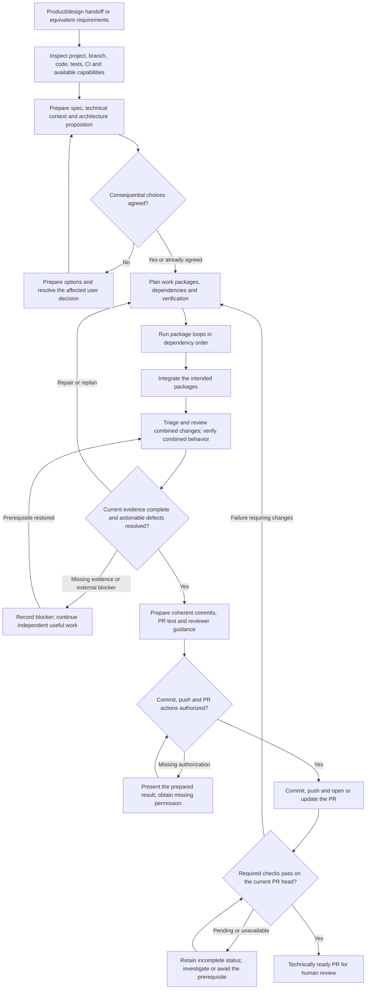
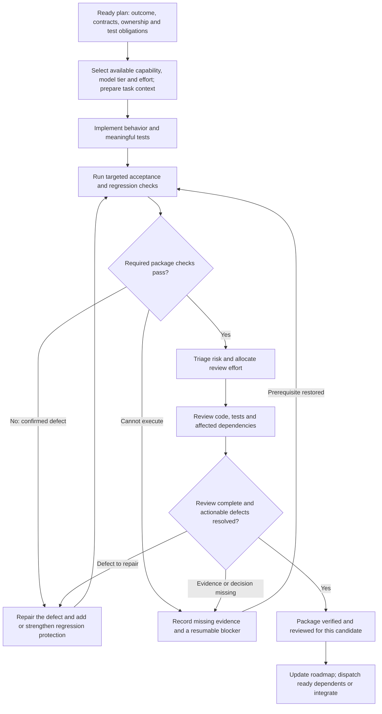

# Product-engineering lifecycle and evaluations

The implementation loop turns agreed product intent into a technically ready pull request awaiting human review. The user agrees consequential architecture choices up front; the orchestrator then coordinates bounded implementation, meaningful verification, independent review where available, and defect repair within that baseline.

Start with [running-implementation-loops](../../skills/product-engineering/running-implementation-loops/SKILL.md). It routes to the other seven skills as needed. The diagrams below describe the intended lifecycle; [observed evaluation results](results.md) distinguish what has actually been exercised from what remains unverified.

## Lifecycle overview



Existing agreement and authorization carry forward. The architecture and publication gates require attention only when their decisions remain unresolved. Merge, release, and deployment are separate authorized workflows. Required human approvals may still prevent merging a technically ready PR.

The orchestrator can run independent, ready packages concurrently when contracts and ownership permit it. It integrates their outputs and verifies the combined behavior; separate green package checks do not establish that the feature works as a whole.

## Inside each package loop



Every review round starts with triage, including review of repairs. Findings retain their history and close only after the fix and appropriate evidence are inspected. Review hypotheses need substantiation; priority determines urgency and routing, while **all confirmed actionable in-scope defects must be repaired**.

If a repair changes scope, architecture, or a shared contract, return to the affected baseline decision and plan before continuing. If two equivalent repair attempts fail without new evidence, escalate diagnosis or replan. Independent work can continue while a package is blocked; the blocked package cannot be labeled complete.

## Skills and artifacts at each phase

| Phase or responsibility | Skill | Main artifacts and evidence |
|---|---|---|
| Coordinate the lifecycle and resume work | [running-implementation-loops](../../skills/product-engineering/running-implementation-loops/SKILL.md) | Current phase, capability routing, dependencies, handoffs and completion judgment |
| Establish technical context and agree architecture | [preparing-engineering-specs](../../skills/product-engineering/preparing-engineering-specs/SKILL.md) | `spec.md`, `context.md` or existing `research.md`, decision references |
| Decompose and schedule executable work | [planning-implementation](../../skills/product-engineering/planning-implementation/SKILL.md) | `implementation-roadmap.md`, `work-packages/<id>/plan.md` |
| Implement a bounded package and repairs | [implementing-work-packages](../../skills/product-engineering/implementing-work-packages/SKILL.md) | Code, tests, implementation handback and actual check results |
| Design checks before coding, then execute them | [verifying-implementation](../../skills/product-engineering/verifying-implementation/SKILL.md) | Requirement-to-check mapping and revision-specific `verification.md` |
| Triage, review and verify finding closure | [reviewing-code-changes](../../skills/product-engineering/reviewing-code-changes/SKILL.md) | Revision-specific `review.md` with findings and repair history |
| Preserve facts and recovery state throughout | [recording-worklogs](../../skills/product-engineering/recording-worklogs/SKILL.md) | `worklog.md`: chronological events and a current checkpoint |
| Prepare and publish the authorized reviewer handoff | [preparing-pull-requests](../../skills/product-engineering/preparing-pull-requests/SKILL.md) | Coherent commits, concise PR, current-head CI and reviewer focus |

Adopt the target project's artifact conventions. The default root is `docs/product-engineering/<initiative>/`; these files belong in the project being implemented. Small tasks can combine the same responsibilities into one document. Larger initiatives retain separate package histories plus aggregate review and verification at initiative level.

## Guidance for running the loop

**Design verification before implementation.** Map requirements and plausible failure modes to checks. Use units for logic and invariants, integration tests for real boundaries, and critical E2E journeys for running application behavior. Prefer Playwright when adding browser E2E while preserving suitable existing tooling. Avoid fixed pyramid percentages; inspect whether assertions would reject a plausible incorrect implementation.

**Choose model tier and effort separately.** Discover the actual available models and controls. Start clerical recording at the lowest capable tier with minimal effort, bounded implementation/tests at a capable mid tier with moderate effort, and architecture, difficult diagnosis, high-risk review/repairs, and final synthesis at a high/top tier. Fast triage can use mid tier and low effort, escalating uncertainty. A small diff can still warrant strong review. See the [routing guidance](../../skills/product-engineering/running-implementation-loops/references/routing-and-delegation.md).

**Prepare every delegation.** Supply the bounded outcome, relevant requirements and decisions, accessible source/context references, candidate identity, ownership, dependencies, permitted actions, expected evidence and result path, and escalation conditions. Load deeper references only when needed. Use the [task packet](../../skills/product-engineering/running-implementation-loops/templates/task-packet.md) rather than forwarding the entire conversation.

**Keep evidence attached to the candidate.** Record commands or inspection methods, environment, results, and the exact examined content. Account for relevant staged, unstaged and untracked files as well as deletions. Code, tests, configuration, dependencies, or integration changes invalidate affected evidence. Refresh it before accepting the change; old-head CI cannot verify a newer PR head.

**Record progress at meaningful transitions.** After decisions, completed tasks, checks, findings, repairs, integration, and blockers, send factual events to one worklog writer. The lowest-capable-tier recorder returns `Done` only after verifying event and checkpoint persistence. The orchestrator verifies the write too. Retried events must not duplicate history or overwrite a newer checkpoint.

**Resume from reality.** Flush the worklog before session handoff. On resumption, reconcile its checkpoint with the actual branch, worktree, active assignments, open findings, and evidence. Preserve prior agreement and authorization. Recover incomplete writes before dispatching more work.

**Expose limitations without weakening the gate.** Missing agents or model controls permit a sequential fallback; self-review remains labeled self-review. Missing mandatory execution evidence leaves the affected work incomplete. Pending checks, flaky retries, and unperformed browser journeys are not passes. The endpoint requires the agreed evidence and an actual authorized PR, with remaining human approval stated accurately.

## Evaluating the lifecycle

The exercises below evaluate the skills' behavior, separately from `scripts/validate.py`, which checks repository format. Fixtures are deliberately incomplete and are not production examples or a recommended application stack. Use the lifecycle diagrams to assess where an evaluator advanced, returned for repair, or correctly retained a blocker.

### Runnable fixture

`fixture/` contains a standard-library Python record service, a browser interface, and an initial happy-path test. The fixture trusts a supplied principal solely to simulate identity; evaluating real authentication is outside this fixture. It binds only to loopback. Use synthetic data and an isolated temporary copy.

Give an implementing agent only the fixture copy, relevant skills, and this request:

> Use running-implementation-loops to implement the agreed saved-record behavior. R1: Alice can update her saved record and read the result after reload/restart. R2: Bob cannot read or update Alice's record, and a denied update must leave stored data unchanged. R3: the browser shows success or failure and the persisted title. The existing local JSON store and simulated identity header are the agreed architecture for this evaluation. Inspect the implementation and tests, plan the bounded change, implement it, and prepare review and verification artifacts. Work only in this temporary copy; do not commit, publish, access external services, or spawn further agents. PR text may be prepared, but publication is unavailable. Report actual execution and any evidence gaps.

Do not supply the grader or expected findings to that agent. The initial fixture test runs with:

```bash
python3 -m unittest discover -s evaluations/product-engineering/fixture -p 'test_*.py' -v
```

After the candidate is produced, run the separate grader against its `app.py`:

```bash
python3 evaluations/product-engineering/grade.py /absolute/path/to/candidate/app.py
```

To reproduce the recorded candidate instead of running a new agent, copy `fixture/` to a temporary directory and apply `observed-candidate.patch` there with `patch -p1 -i <absolute-patch-path>`. Compare app/test hashes with `observed-candidate.json`, then run its tests and the grader. Keep that patch and the grader hidden from a fresh implementing agent.

The grader checks persisted outcomes and denied operations both through the store and real loopback HTTP. It returns nonzero for failures. It should fail against the initial fixture; that demonstrates the initial test suite is insufficient. Each run uses temporary synthetic data and closes its server.

Run a browser journey when available. Start the candidate with `python3 app.py --port <free-port> --data <temporary-data-file>` and open its loopback URL. As Alice, load and update the record, reload, and inspect the stored result. As Bob, attempt a read and update, then return to Alice and confirm the record was unchanged. Verify status feedback and inspect persistence, not just a screenshot. Shut down the server after the exercise.

### Additional trials

The coordinator's evaluation reference covers architecture agreement, compact regression, parallel integration, weak tests, small high-risk changes, stale evidence, interrupted sessions, recorder failures, missing capabilities, and restricted PR publication. Run these as artifact-producing tasks in isolated directories, with synthetic hosting responses where needed.

For parallel integration, use two copies of a repaired fixture at the same baseline: one adds trimming and another adds a title length limit. Give each worker its contract and ownership, then test the combined behavior with padded input whose trimmed length is valid. A length check applied before trimming exposes a semantic integration error even if both isolated checks pass. Keep this fault-injection scenario separate from a claim that the full orchestrator was exercised concurrently.

Assess outcomes, actual artifacts, and truthful readiness. A simulated CI state is not a real hosting test, and one successful host/trial does not establish reliability across hosts or models. Record observed trials and limitations in [results.md](results.md).
